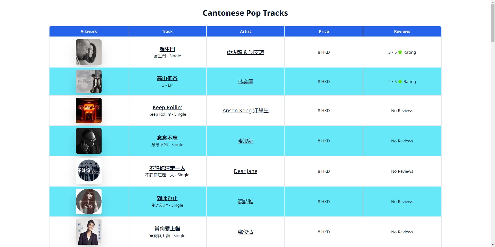
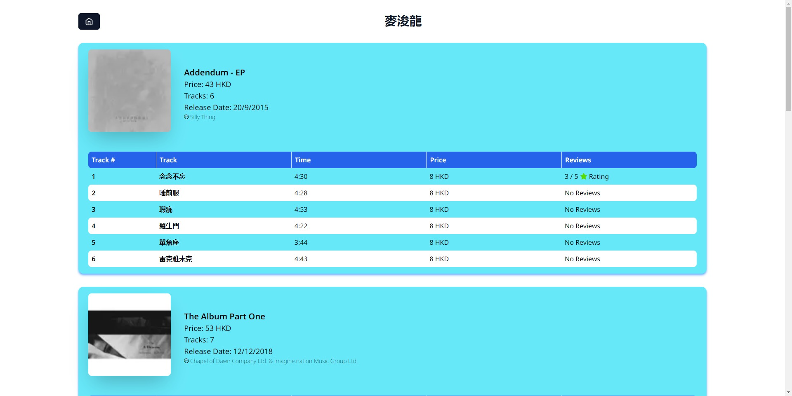
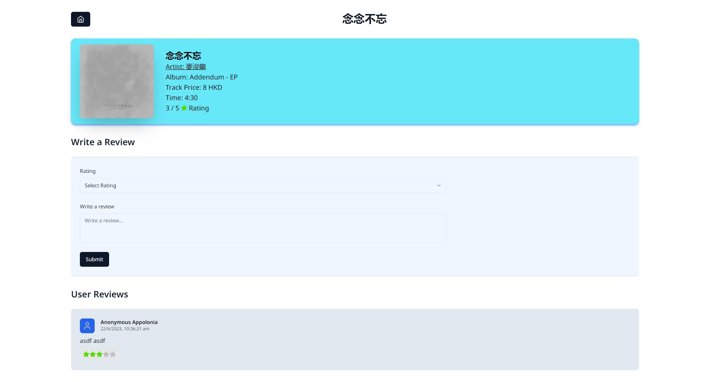

# Anthony_Stoltzfus_Frontend_Engineer_Technical_Assessment

## 📃 Choice of framework & major packages

- Framework: Nextjs 13 (App Router)
  - Async and await in Server Components ( used in Home, Artist & Track pages)
    - Results will automatically be cached for subsequent requests
    - Home: Static Rendering, Artist & Track: Dynamic Rendering
  - Seemless integration with typescript
    - For increased safety, type inference and intelliSense
- Packages:
  - Tailwind: Styling package to build customizable and complex responsive layouts with the speed and developer experience of inline styles 
  - Radix Ui: Radix is a low-level UI component library with a focus on accessibility, customization and developer experience.
  - Zod: A TypeScript-first schema declaration and validation library.

## 🚀 How to run

```sh
npm install
```

```sh
npm run dev
```

## Potential improvements

- Building simple database for handling reveiws ( instead of session storage)
    - Session storage has obvious drawbacks of storage limits and data persistance on the same session, which is used in this project for handling reviews
    - When users post reviews it will be sent to the "reviews" table in the database and persist across web instead of just individual browsers
- Improve the SEO of the pages for google discoverability. While "Perforamce", "Accessibility" and "Best Practices" are already high rating
- Further imporve the ui with more interatactions and animations
    - Add buttons to direct to itunes page
    - Improve styling, animations and various interations

## Production considerations

- No considerations need to be taken into account as this project does not have any secret (.env) because there is no database or other production secrets

## Assumptions

- The freedom of layout and page routing with home(/), artist(/artist/{artistid} showing 5 related albums) and track(/track/{trackId} showing track, reviews) 
- One of the main assumptions of this project is the use of sesssion storage to store reviews as it is stated that should be "persisting within the same browser session" on the assessment document
- Freedom to use alternate frameworks of ReactJS like NextJS

## 📷 Screens




